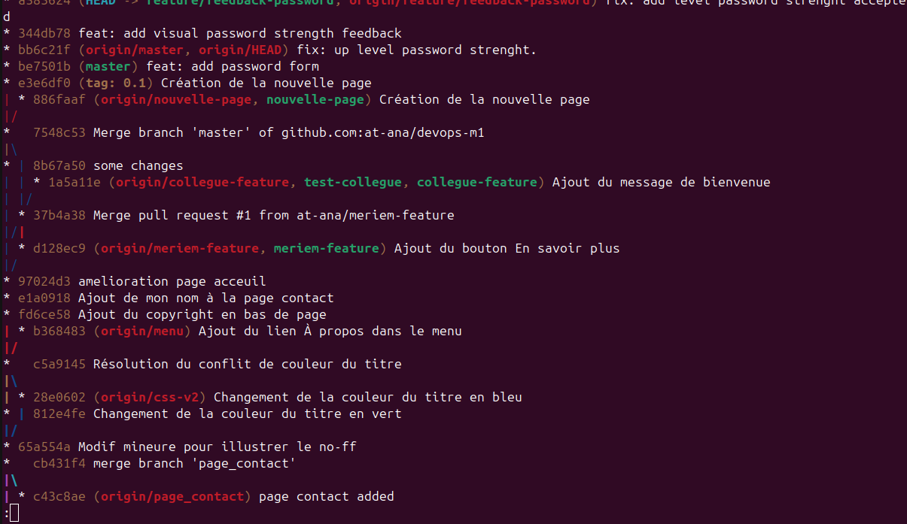
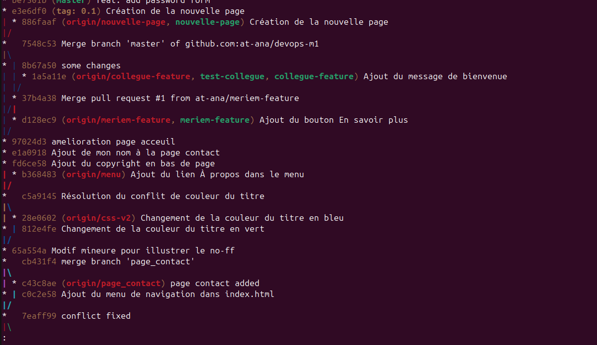
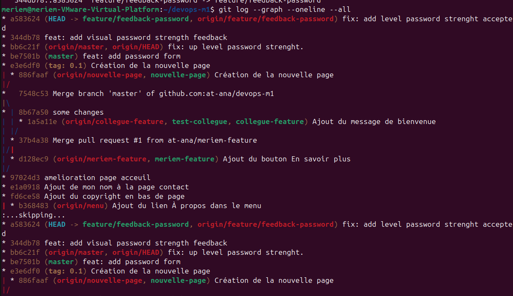

# Nouvelle page

## Git log avant le squash

## Graphe Git final

Commande utilisée : git log --graph --oneline --all

# Rapport — Conflits, Rebase & Code Review

**Auteurs :** Meriem Dahbi et Anas ATERTOR

## Q1. Quelle est la différence entre `git push --force` et `git push --force-with-lease` ? Pourquoi la seconde est-elle indispensable en équipe ?

La commande `git push --force` permet de forcer l'envoi de notre branche vers le dépôt distant, même si l'historique distant est différent. Le problème est qu'elle peut écraser les modifications faites par quelqu'un d'autre.

`git push --force-with-lease` est plus sécurisé. Git vérifie d'abord que la branche distante n'a pas été modifiée depuis notre dernière récupération. Si quelqu'un a travaillé dessus entre-temps, le push est refusé.

En équipe, c'est donc préférable d'utiliser `--force-with-lease` pour éviter d'écraser accidentellement le travail d'un autre membre.

## Q2. Pourquoi privilégie-t-on l'usage de `git rebase` par rapport à `git merge` pour maintenir une branche de fonctionnalité à jour ?

Le `rebase` permet de mettre notre branche de fonctionnalité à jour avec les dernières modifications de la branche principale tout en gardant un historique plus simple.

Avec `merge`, Git ajoute généralement un commit de fusion, ce qui peut rendre l'historique plus difficile à lire.

Le `rebase` permet donc d'avoir une suite de commits plus propre et plus linéaire, ce qui est pratique avant de faire une Pull Request.

## Q3. Quel est l'intérêt d'imposer un Squash de commits avant la fusion d'une Pull Request dans un pipeline CI/CD ?

Le Squash permet de regrouper plusieurs commits d'une même fonctionnalité en un seul commit.

Par exemple, pendant le développement, on peut avoir plusieurs commits comme `wip`, `fix` ou `test`. Les regrouper permet d'avoir un historique plus propre et plus facile à comprendre.

Dans un pipeline CI/CD, cela facilite aussi le suivi des modifications et permet de retrouver plus facilement quelle fonctionnalité correspond à un changement dans le projet.
