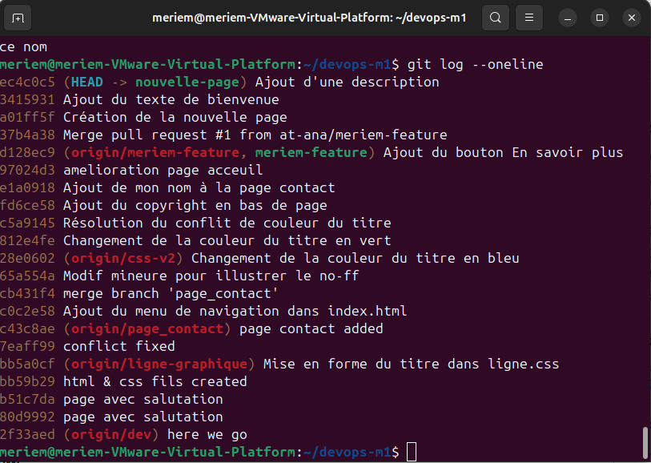
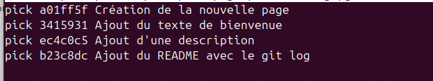
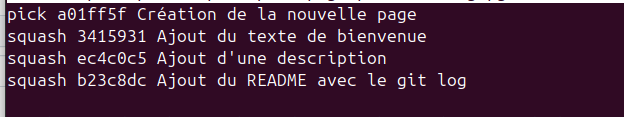

# Nouvelle page

## Git log avant le squash

## Preuves du squash

### Avant le squash
Git log avant le squash :

### Pendant le squash
Configuration du rebase interactif :

### Après le squash
Git log après le squash :

